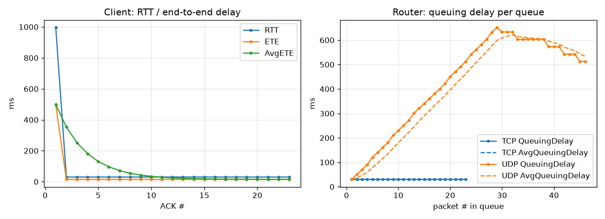

# Network Router Simulator (TCP/UDP)

> 計算機網路課程專題｜國立中山大學電機所｜C / C++、POSIX sockets、pthreads

[中文](#中文) | [English](#english)

---

## 中文

在單一台 Linux 主機上模擬 **Client ↔ Router ↔ Server** 三節點網路。Router 負責轉送 TCP 與 UDP 封包，並模擬排隊延遲與服務時間；兩端依每個 ACK 量測 RTT、端到端延遲與吞吐量。

### 特色

- **自訂封包表頭**：自己定義 `MACHeader`、`IPHeader`、`UDPHeader` 與 TCP 表頭結構，封裝成 1518 bytes 的訊框（MTU 1500）；三支程式共用 `p1p2/packet.h`，並在編譯時檢查封包大小不超過佇列容量
- **虛擬 IP 路由**：Router 讀取封包中的目的虛擬 IP，決定轉送給 Server 或兩個 Client 之一
- **執行緒安全佇列**：以 `pthread_mutex_t` 與 `pthread_cond_t` 實作環狀緩衝區（生產者／消費者），TCP、UDP 各一個佇列
- **多執行緒 Router**：5 個執行緒分別處理 TCP 接收、TCP 發送、ACK 轉送、UDP 接收、UDP 發送
- **延遲模型**：每次出列記錄排隊時間與 30 ms 服務時間，並以 EWMA 計算平均排隊延遲
- **效能量測**：Client 與 Server 依 ACK 計算 RTT、單向延遲（ETE ≈ RTT / 2）、EWMA 平均 ETE 與吞吐量（kbps）

### 架構

```
            TCP（資料）               TCP（資料）
 Client  ───────────────▶  Router  ───────────────▶  Server
   ▲        UDP（資料）      │  ▲      UDP（資料）      │
   └────────────────────────┘  └──────────────────────┘
               ACK 經由 Router 轉送回來源端
```

### 版本

| 資料夾 | 說明 |
|---|---|
| `p1p2/` | Part 1 + 2：TCP／UDP 轉送、排隊延遲、虛擬 IP 路由 |
| `p2-throughput/` | Part 2 改寫版：每個方向使用獨立 ACK port，並逐封包量測吞吐量 |

### 編譯與執行（Linux）

```bash
make            # 一次編譯 p1p2 與 p2-throughput 共 6 支程式（輸出到 bin/）
make run        # 依序啟動 server → router → client，輸出存到 logs/p1p2-*.log
make run ARGS="-n 50 -p 9100"   # 指定封包數與基準 port（server 用 9100、router 9102、client 9103）
make run-p2     # 執行 p2-throughput 版本
make clean
```

也可以手動在三個終端機依序執行 `bin/p1p2-server`、`bin/p1p2-router`、`bin/p1p2-client`（三支要給相同的 `-n`／`-p` 參數）。
每次 push 都會由 GitHub Actions 在 Ubuntu 上自動編譯並跑一次模擬（`.github/workflows/build.yml`）。

### 執行結果（節錄）

```
# client                    # router
-----TCP ACK 23-----        QueueLength:0
RTT:30.473ms                QueuingTime:0.050ms
ETE:15.236ms                ServiceTime:30.117ms
AvgETE:15.543ms             QueuingDelay:30.167ms
Throughput:16.802kbps       AvgQueuingDelay:30.373ms
```

### 結果分析

`make run` 後執行 `python3 scripts/plot_results.py`，會把 log 整理成 CSV 並畫圖（下圖由 GitHub Actions 實際執行產生，原始數據在 [`docs/`](docs)）：



- **Client RTT**：第一個 ACK 約 1 秒（啟動階段），之後穩定在約 30.5 ms，幾乎等於 router 的 30 ms 服務時間；EWMA 平均 ETE 隨之平滑收斂到約 15 ms
- **TCP 佇列**：封包依 ACK 逐一送出，佇列長度維持 0，排隊延遲 ≈ 服務時間 30 ms
- **UDP 佇列**：沒有流量控制，封包抵達速度比 30 ms 服務時間快，佇列不斷累積，排隊延遲一路上升到約 650 ms，送完後才逐漸下降——這正是 TCP 流量控制與 UDP 差異的直接證據

### 學到的東西

- 連線導向（TCP）與非連線（UDP）的 socket 程式設計
- 用 mutex 與 condition variable 同步生產者／消費者執行緒
- 排隊延遲、服務時間與 RTT 的關係，以及為什麼需要 EWMA 平滑

---

## English

A three-node network simulation (**client ↔ router ↔ server**) that runs on one Linux host. The router forwards TCP and UDP traffic and models queuing and service delay. Both endpoints measure RTT, end-to-end delay and throughput for every ACK.

### Highlights

- **Hand-built packet headers**: custom `MACHeader`, `IPHeader`, `UDPHeader` and TCP header structs packed into a 1518-byte frame (MTU 1500), shared by all three programs through `p1p2/packet.h` with a compile-time size check
- **Virtual-IP routing**: the router reads the destination virtual IP and forwards to the server or to one of two clients
- **Thread-safe queues**: a circular buffer guarded by `pthread_mutex_t` and `pthread_cond_t` (producer/consumer), one for TCP and one for UDP
- **Multi-threaded router**: five threads for TCP receive, TCP send, ACK forwarding, UDP receive and UDP send
- **Delay model**: each dequeue records queuing time plus a 30 ms service time; the average queuing delay is smoothed with EWMA
- **Metrics**: RTT, one-way delay (ETE ≈ RTT / 2), EWMA-averaged ETE and throughput (kbps)

### Versions

| Folder | Description |
|---|---|
| `p1p2/` | Parts 1 + 2: TCP/UDP forwarding with queuing delay and virtual-IP routing |
| `p2-throughput/` | Part 2 rewrite: separate ACK ports per direction and per-packet throughput |

### Build & Run (Linux)

```bash
make            # builds all six programs (p1p2 + p2-throughput) into bin/
make run        # starts server → router → client, logs go to logs/p1p2-*.log
make run ARGS="-n 50 -p 9100"   # packet count and base port (server 9100, router 9102, client 9103)
make run-p2     # runs the p2-throughput version
make clean
```

GitHub Actions builds the project and runs a simulation on Ubuntu on every push (`.github/workflows/build.yml`).

### Results

Run `python3 scripts/plot_results.py` after `make run` to turn the logs into CSV files and a chart (this one was produced by GitHub Actions; raw data in [`docs/`](docs)):


- **Client RTT** is about 1 s for the first ACK (start-up), then steady at ~30.5 ms, essentially the router's 30 ms service time.
- **TCP queue**: packets are released one ACK at a time, so the queue stays empty and the delay equals the 30 ms service time.
- **UDP queue**: with no flow control, packets arrive faster than they are served, the queue builds up and the delay climbs to ~650 ms before draining — a direct illustration of TCP flow control versus UDP.

### What I learned

- Socket programming for connection-oriented (TCP) and connectionless (UDP) transport
- Synchronizing producer/consumer threads with mutexes and condition variables
- How queuing delay, service time and RTT relate, and why smoothing (EWMA) is needed
